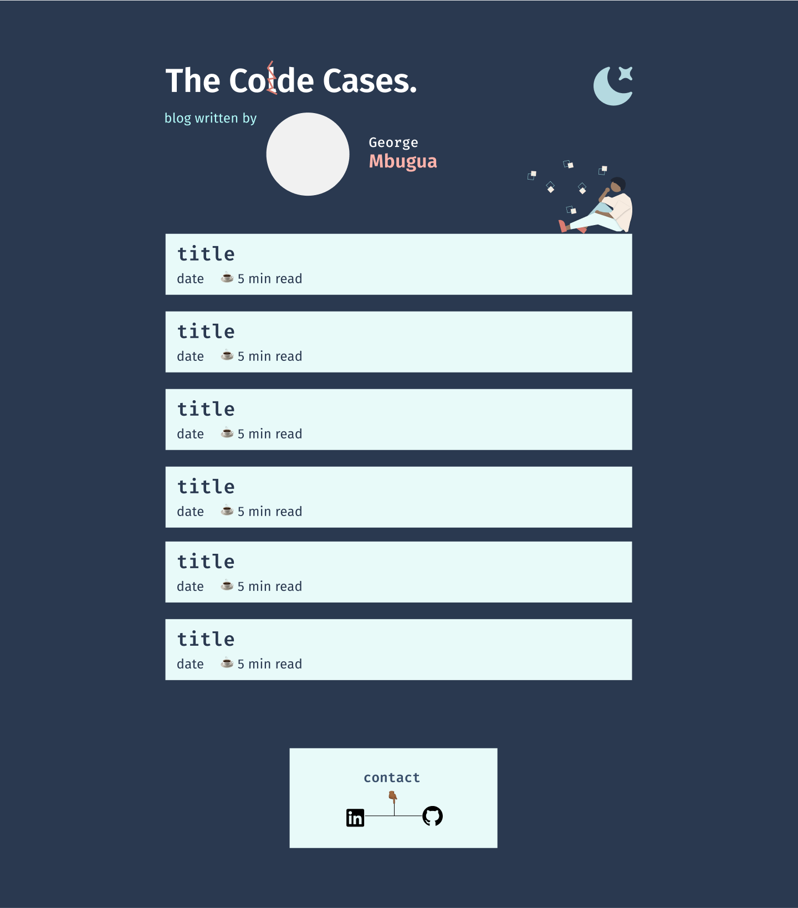

# Code Cases

## Personal Blog By George Mbugua
Blog covers my experience as a developer and the highlights of the projects/work I do during my day to day (Arranged in a ***Cold Case*** manner :wink:)
*  **Stay tuned** for a post about how I built the blog!
* Designed on **[Figma](https://www.figma.com/community/explore)** :triumph:

## Stack / Architecture
* **Front-End Framework** - Vue JS
* **CSS Framework** - Tailwind CSS
* **Headless CMS** - Netlify + Nuxt Content
